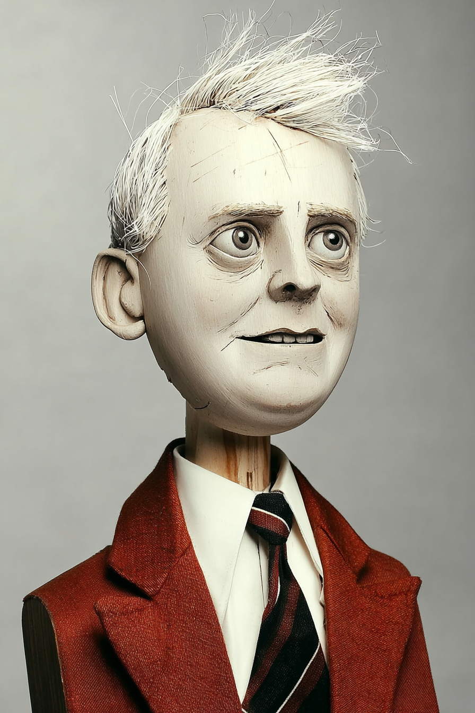
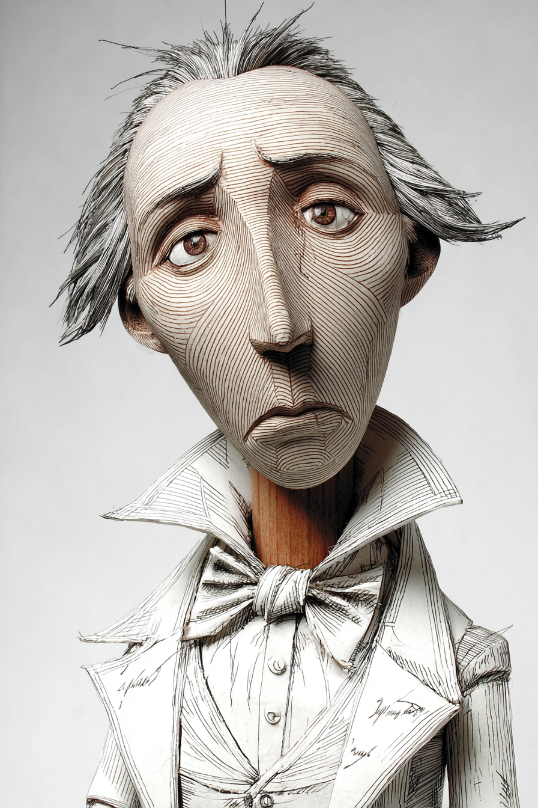
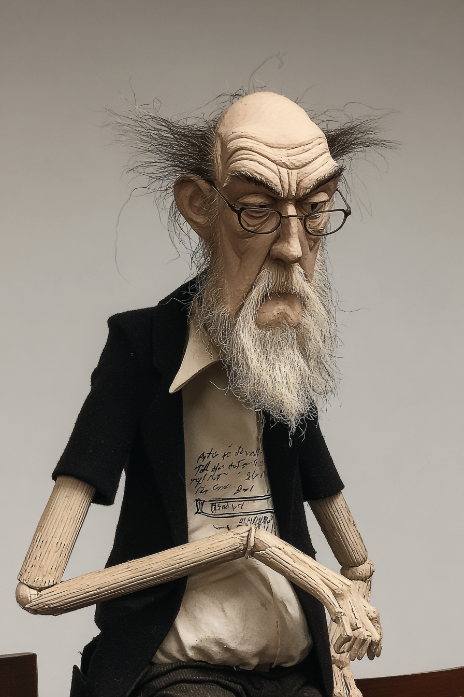

# Introduction to Python Programming: with Claude — Wayback Sections

> Extracted from `chapters/`. Each entry corresponds to one chapter file.
> Sections are instructor-authored. Missing sections show a placeholder only.
> Do not edit this file directly — edit the source chapter file, then re-run extraction.

---

## Chapter 00: Chapter 0 — Claude Code Basics
*Source: `chapters/00-claude-code-basics.md`*

##  AI Wayback Machine
**Guido van Rossum** was created Python in 1989 as a Christmas hobby project — and led its development as Benevolent Dictator For Life through 2018.

**Run this:**

```
Who is Guido van Rossum, and how does their work connect to Python basics we covered in this chapter? Keep it to three paragraphs. End with the single most surprising thing about their career or ideas.
```

→ Search **"Guido van Rossum"** on Wikipedia.

**Now make the prompt better.** Try one of these:

- Ask it to apply Guido van Rossum's ideas to a small Python program you'd write.
- Add a constraint: "Answer including criticisms or limits of Guido van Rossum's framework."

What changes? What gets better? What gets worse?

---

## Chapter 00: Introduction to Python Programming: with Claude
*Source: `chapters/00-frontmatter.md`*

> **Section not yet authored.** No `## AI Wayback Machine` block found in this chapter file.
> To add this section, edit the source chapter file directly.

---

## Chapter 00: Introduction
*Source: `chapters/00-introduction.md`*

> **Section not yet authored.** No `## AI Wayback Machine` block found in this chapter file.
> To add this section, edit the source chapter file directly.

---

## Chapter 01: Chapter 1 — Statements
*Source: `chapters/01-statements.md`*

## AI Wayback Machine

**Niklaus Wirth** designed Pascal, Modula, and Oberon — and his clear principles for statement design influence Python's syntax.

**Run this:**

```
Who is Niklaus Wirth, and how does their work connect to Python statements we covered in this chapter? Keep it to three paragraphs. End with the single most surprising thing about their career or ideas.
```

→ Search **"Niklaus Wirth"** on Wikipedia.

**Now make the prompt better.** Try one of these:

- Ask it to apply Niklaus Wirth's ideas to a small Python program you'd write.
- Add a constraint: "Answer including criticisms or limits of Niklaus Wirth's framework."

What changes? What gets better? What gets worse?

---

---

## Chapter 02: Chapter 2 — Expressions
*Source: `chapters/02-expressions.md`*

## AI Wayback Machine



*Puppet Art by [Nik Bear Brown](https://www.nikbearbrown.com/).*

**Run this:**

```
Who is Alonzo Church, and how does their work connect to expressions we covered in this chapter? Keep it to three paragraphs. End with the single most surprising thing about their career or ideas.
```

→ Search **"Alonzo Church"** on Wikipedia.

**Now make the prompt better.** Try one of these:

- Ask it to apply Alonzo Church's ideas to a small Python program you'd write.
- Add a constraint: "Answer including criticisms or limits of Alonzo Church's framework."

What changes? What gets better? What gets worse?

---

## Chapter 03: Chapter 3 — Objects
*Source: `chapters/03-objects.md`*

## AI Wayback Machine

**Alan Kay** designed Smalltalk and coined "object-oriented programming" — the paradigm Python implements in its own way.

**Run this:**

```
Who is Alan Kay, and how does their work connect to objects we covered in this chapter? Keep it to three paragraphs. End with the single most surprising thing about their career or ideas.
```

→ Search **"Alan Kay"** on Wikipedia.

**Now make the prompt better.** Try one of these:

- Ask it to apply Alan Kay's ideas to a small Python program you'd write.
- Add a constraint: "Answer including criticisms or limits of Alan Kay's framework."

What changes? What gets better? What gets worse?

---

---

## Chapter 04: Chapter 4 — Decisions
*Source: `chapters/04-decisions.md`*

## AI Wayback Machine

**Edsger Dijkstra** argued in 1968 that `goto` considered harmful — and laid the groundwork for structured decision flow in modern programming.


*Puppet Art by [Nik Bear Brown](https://www.nikbearbrown.com/).*

**Run this:**

```
Who is Edsger Dijkstra, and how does their work connect to decisions we covered in this chapter? Keep it to three paragraphs. End with the single most surprising thing about their career or ideas.
```

→ Search **"Edsger Dijkstra"** on Wikipedia.

**Now make the prompt better.** Try one of these:

- Ask it to apply Edsger Dijkstra's ideas to a small Python program you'd write.
- Add a constraint: "Answer including criticisms or limits of Edsger Dijkstra's framework."

What changes? What gets better? What gets worse?

---

## Chapter 05: Chapter 5 — Loops
*Source: `chapters/05-loops.md`*

## AI Wayback Machine

**John Backus** led the team that built FORTRAN in 1957 — bringing structured loops to programming for the first time.

**Run this:**

```
Who is John Backus, and how does their work connect to loops we covered in this chapter? Keep it to three paragraphs. End with the single most surprising thing about their career or ideas.
```

→ Search **"John Backus"** on Wikipedia.

**Now make the prompt better.** Try one of these:

- Ask it to apply John Backus's ideas to a small Python program you'd write.
- Add a constraint: "Answer including criticisms or limits of John Backus's framework."

What changes? What gets better? What gets worse?

---

---

## Chapter 06: Chapter 6 — Functions
*Source: `chapters/06-functions.md`*

## AI Wayback Machine

**Haskell Curry** was a mathematician whose work on combinatorial logic prefigured functional programming — the Haskell language is named after him.

**Run this:**

```
Who is Haskell Curry, and how does their work connect to functions we covered in this chapter? Keep it to three paragraphs. End with the single most surprising thing about their career or ideas.
```

→ Search **"Haskell Curry"** on Wikipedia.

**Now make the prompt better.** Try one of these:

- Ask it to apply Haskell Curry's ideas to a small Python program you'd write.
- Add a constraint: "Answer including criticisms or limits of Haskell Curry's framework."

What changes? What gets better? What gets worse?

---

## Chapter 07: Chapter 7 — Modules
*Source: `chapters/07-modules.md`*

## AI Wayback Machine

**David Parnas** wrote the foundational 1972 paper on modularity and information hiding — defining the principles modern Python modules implement.

**Run this:**

```
Who is David Parnas, and how does their work connect to modules we covered in this chapter? Keep it to three paragraphs. End with the single most surprising thing about their career or ideas.
```

→ Search **"David Parnas"** on Wikipedia.

**Now make the prompt better.** Try one of these:

- Ask it to apply David Parnas's ideas to a small Python program you'd write.
- Add a constraint: "Answer including criticisms or limits of David Parnas's framework."

What changes? What gets better? What gets worse?

---

---

## Chapter 08: Chapter 8 — Strings
*Source: `chapters/08-strings.md`*

## AI Wayback Machine

**Joseph Marie Jacquard** invented the punched-card programmable loom in 1804 — the conceptual ancestor of string-and-instruction encoded computation.



*Puppet Art by [Nik Bear Brown](https://www.nikbearbrown.com/).*

**Run this:**

```
Who is Joseph Marie Jacquard, and how does their work connect to strings we covered in this chapter? Keep it to three paragraphs. End with the single most surprising thing about their career or ideas.
```

→ Search **"Joseph Marie Jacquard"** on Wikipedia.

**Now make the prompt better.** Try one of these:

- Ask it to apply Joseph Marie Jacquard's ideas to a small Python program you'd write.
- Add a constraint: "Answer including criticisms or limits of Joseph Marie Jacquard's framework."

What changes? What gets better? What gets worse?

---

## Chapter 09: Chapter 9 — Lists
*Source: `chapters/09-lists.md`*

## AI Wayback Machine

**John McCarthy** invented LISP in 1958 — the language built around lists, which influences how every modern language handles collections.

**Run this:**

```
Who is John McCarthy, and how does their work connect to lists we covered in this chapter? Keep it to three paragraphs. End with the single most surprising thing about their career or ideas.
```

→ Search **"John McCarthy"** on Wikipedia.

**Now make the prompt better.** Try one of these:

- Ask it to apply John McCarthy's ideas to a small Python program you'd write.
- Add a constraint: "Answer including criticisms or limits of John McCarthy's framework."

What changes? What gets better? What gets worse?

---

---

## Chapter 10: Chapter 10 — Dictionaries
*Source: `chapters/10-dictionaries.md`*

## AI Wayback Machine

**Hans Peter Luhn** invented the hash function in 1953 for an IBM project — the technique that makes Python dictionaries fast.

**Run this:**

```
Who is Hans Peter Luhn, and how does their work connect to dictionaries we covered in this chapter? Keep it to three paragraphs. End with the single most surprising thing about their career or ideas.
```

→ Search **"Hans Peter Luhn"** on Wikipedia.

**Now make the prompt better.** Try one of these:

- Ask it to apply Hans Peter Luhn's ideas to a small Python program you'd write.
- Add a constraint: "Answer including criticisms or limits of Hans Peter Luhn's framework."

What changes? What gets better? What gets worse?

---

## Chapter 11: Chapter 11 — Classes
*Source: `chapters/11-classes.md`*

## AI Wayback Machine

**Kristen Nygaard** co-designed Simula in the 1960s — the first object-oriented language and the ancestor of every modern class system.

**Run this:**

```
Who is Kristen Nygaard, and how does their work connect to classes we covered in this chapter? Keep it to three paragraphs. End with the single most surprising thing about their career or ideas.
```

→ Search **"Kristen Nygaard"** on Wikipedia.

**Now make the prompt better.** Try one of these:

- Ask it to apply Kristen Nygaard's ideas to a small Python program you'd write.
- Add a constraint: "Answer including criticisms or limits of Kristen Nygaard's framework."

What changes? What gets better? What gets worse?

---

---

## Chapter 12: Chapter 12 — Recursion
*Source: `chapters/12-recursion.md`*

## AI Wayback Machine

**Stephen Kleene** developed the theory of recursive functions in the 1930s — the mathematical foundation of recursion in programming.

**Run this:**

```
Who is Stephen Kleene, and how does their work connect to recursion we covered in this chapter? Keep it to three paragraphs. End with the single most surprising thing about their career or ideas.
```

→ Search **"Stephen Kleene"** on Wikipedia.

**Now make the prompt better.** Try one of these:

- Ask it to apply Stephen Kleene's ideas to a small Python program you'd write.
- Add a constraint: "Answer including criticisms or limits of Stephen Kleene's framework."

What changes? What gets better? What gets worse?

---

## Chapter 13: Chapter 13 — Inheritance
*Source: `chapters/13-inheritance.md`*

## AI Wayback Machine

**Ole-Johan Dahl** co-designed Simula with Kristen Nygaard — and developed the inheritance mechanism that all modern OO languages descend from.

**Run this:**

```
Who is Ole-Johan Dahl, and how does their work connect to inheritance we covered in this chapter? Keep it to three paragraphs. End with the single most surprising thing about their career or ideas.
```

→ Search **"Ole-Johan Dahl"** on Wikipedia.

**Now make the prompt better.** Try one of these:

- Ask it to apply Ole-Johan Dahl's ideas to a small Python program you'd write.
- Add a constraint: "Answer including criticisms or limits of Ole-Johan Dahl's framework."

What changes? What gets better? What gets worse?

---

---

## Chapter 14: Chapter 14 — Files
*Source: `chapters/14-files.md`*

## AI Wayback Machine

**Ken Thompson** co-designed Unix and its file system — defining how programs work with files in every modern OS.



*Puppet Art by [Nik Bear Brown](https://www.nikbearbrown.com/).*

**Run this:**

```
Who is Ken Thompson, and how does their work connect to files we covered in this chapter? Keep it to three paragraphs. End with the single most surprising thing about their career or ideas.
```

→ Search **"Ken Thompson"** on Wikipedia.

**Now make the prompt better.** Try one of these:

- Ask it to apply Ken Thompson's ideas to a small Python program you'd write.
- Add a constraint: "Answer including criticisms or limits of Ken Thompson's framework."

What changes? What gets better? What gets worse?

---

## Chapter 15: Chapter 15 — Data Science
*Source: `chapters/15-data-science.md`*

## AI Wayback Machine

**John Tukey** invented exploratory data analysis — the framework underlying every modern Python data-science workflow.

**Run this:**

```
Who is John Tukey, and how does their work connect to data science we covered in this chapter? Keep it to three paragraphs. End with the single most surprising thing about their career or ideas.
```

→ Search **"John Tukey"** on Wikipedia.

**Now make the prompt better.** Try one of these:

- Ask it to apply John Tukey's ideas to a small Python program you'd write.
- Add a constraint: "Answer including criticisms or limits of John Tukey's framework."

What changes? What gets better? What gets worse?

---

---

## Chapter 99: 99 Back Matter
*Source: `chapters/99-back-matter.md`*

> **Section not yet authored.** No `## AI Wayback Machine` block found in this chapter file.
> To add this section, edit the source chapter file directly.

---
